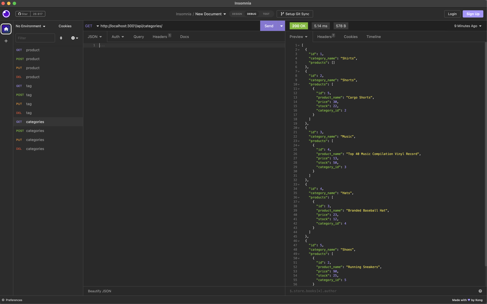

# E-commerce Back End

[Description](#description)---[License](#license)---[Questions](#questions)

## Description
Using this application.\
You can have a back end for your ecommerce website that uses express.js, mysql2, sequelize.\
[Video demonstration](https://drive.google.com/file/d/1lDUgO9BtFlOARlcE6cyB-wrKQOBYzJQc/view)

# Screenshot

## License

The Unlicense [more info](https://choosealicense.com/licenses/)

## Questions

For communication use:\
git: [MaksymStovpovyi](https://github.com/MaksymStovpovyi/)\
email: stovpovymax@gmail.com